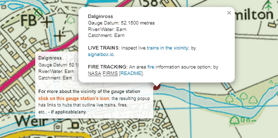

# assets

The maps below pinpoint assets, e.g., gauge stations, care homes.  Each map has a different background, as their names indicate.  Use eacp map's collapsed control panel, on the right hand side, to focus on assets within a catchment of interest. The assets of a few random catchments are displayed by default.

??? note "Extra Notes"
    
    The schools layer, of each map, is currently disabled because the location data of some schools is incorrect.  The layer will be enabled once a new data set is in place. 
    
    Within each map, a circle marker denotes a gauge station.  The diagram below illustrates the tooltip & pop-up of a gauge station marker.  Each gauge station's tooltip provides basic gauge station information, whilst its pop-up provides links to items of interest, or import, within the vicinity of the station.  The pop-up appears after clicking on a gauge station marker.  
    
    <figure markdown="span">
     
     <figcaption></figcaption>
    </figure>

 

-  :fontawesome-solid-earth-europe:{ .lg .middle } __VML SPM RASTER ORDNANCE SURVEY__

    ---

    <a data-preview href="https://d3shei3jylo2wo.cloudfront.net/warehouse/assets/maps/vml-spm-f-raster-ordnance-survey.html" onclick="window.open('https://d3shei3jylo2wo.cloudfront.net/warehouse/assets/maps/vml-spm-f-raster-ordnance-survey.html', 'newwindow', 'width=1325,height=695'); return false;">A VML SPM Raster Ordnance Survey Map Background</a>

-   :fontawesome-solid-earth-europe:{ .lg .middle } __ESRI__

    ---

    <a href="https://d3shei3jylo2wo.cloudfront.net/warehouse/assets/maps/esri.html" onclick="window.open('https://d3shei3jylo2wo.cloudfront.net/warehouse/assets/maps/esri.html', 'newwindow', 'width=1325,height=695'); return false;">An ESRI Map Background</a>

-   :fontawesome-solid-earth-europe:{ .lg .middle } __OPEN STREET__

    ---

    <a data-preview href="https://d3shei3jylo2wo.cloudfront.net/warehouse/assets/maps/open-street-map.html" onclick="window.open('https://d3shei3jylo2wo.cloudfront.net/warehouse/assets/maps/open-street-map.html', 'newwindow', 'width=1325,height=695'); return false;">An Open Street Map Background</a>

-   :fontawesome-solid-earth-europe:{ .lg .middle } __MM SPM ORDNANCE SURVEY__

    ---

    <a data-preview href="https://d3shei3jylo2wo.cloudfront.net/warehouse/assets/maps/mm-spm-ordnance-survey.html" onclick="window.open('https://d3shei3jylo2wo.cloudfront.net/warehouse/assets/maps/mm-spm-ordnance-survey.html', 'newwindow', 'width=1325,height=695'); return false;">A MM SPM Ordnance Survey Map Background</a>

 
 

 
 

 
 

 
 

 
 

